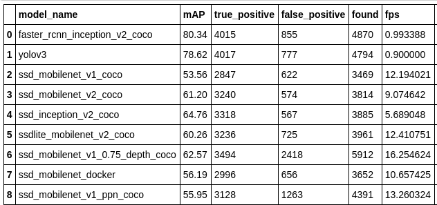
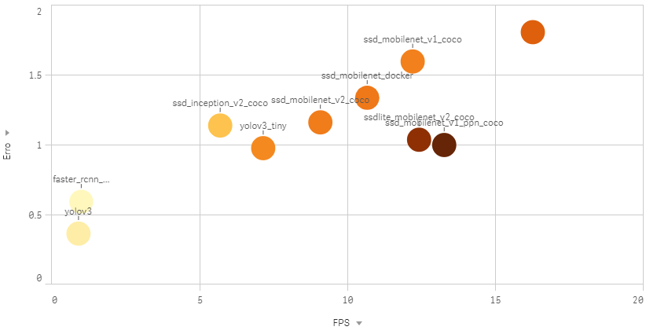
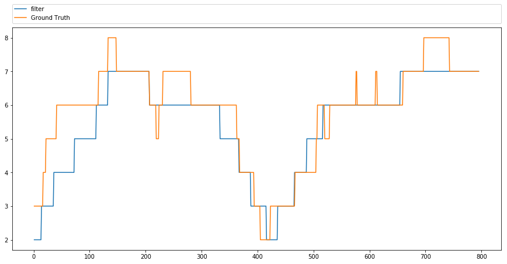

# Object-Detection-People-Counting
This repository is to share a test pipeline of different object detection architectures. You can run different models using a video, WebCam or an ip from a external camera.

The main code of this repository was cloned from two other gits: 

Object Detection: https://github.com/lbeaucourt/Object-detection

mAP:
https://github.com/Cartucho/mAP

# What you can do with this repository?
- Run differents models just changing the weights
- Predict using a video, camera or a ip from a online camera
- Get the mAP from a video with ground truth
- Save the results and analyze it using jupyter notebook

# Outputs

Get the models results

Plot errors

Plot and filter:

### Suggestion to calculate mAP and test the models
I used the MOT challange dataset to get a video with the groud truth data. [Link to dataset](https://motchallenge.net/)

I used this [video](https://motchallenge.net/vis/PETS09-S2L1)

# Start

- Clone the repository
- Install Docker [Download guide](https://docs.docker.com/install/linux/docker-ce/ubuntu/#set-up-the-repository)

Run in your working directory to build the docker image
> docker build -t realtime-objectdetection .

Run the docker image to predict using a WebCam
> bash runDocker.sh

To run using another video source, change the 'Object-detection/exec.sh' file:
>python3 my-object-detection.py -d 1 -o 1 -I 0 -w 4 -q-size 100

>python3 my-object-detection.py -d 1 -o 1 -i MOC.mp4 -w 4 -q-size 100

To understand the parameters check the original repository

## Calculate mAP
To calculate mAP you will use the available code in the 'mAP/' folder.

- First, process the video using the model that you want. This will craete a output file with all people detections. The output is in 'Object-detection/outputs/output.csv'
- Now you need convert the format to what mAP scripts use. This include the predictions and the Ground Truth. Change the paths in the script to what you want.

> python transformFormat.py

This script will take the video and convert in images to get a better visualization when run the mAP. You can comment this if you want. The mAP code allow you to run without animation

Finally:
> python main.py

All parameters for main.py you can see in the [original repository](https://github.com/Cartucho/mAP).

## Changing Models
The weights and configurations are saved into 'Object-detection/model' using <strong>.pb</strong> format.
You can easily download many models from the [model zoo](https://github.com/tensorflow/models/blob/master/research/object_detection/g3doc/detection_model_zoo.md) created by Tensorflow. 

Download the model and copy the  <strong>.pb</strong> file into the models path. That's it.

## Models Analysis and Compare
Some analysis was created using the outputs of predictions and the outputs from mAP script. In the 'Visual Analysis/' folder you can find a jupyter notebook that import predictions from diferents tested models and compare the results.

To save models results and compare, save the files from mAP in a path like:

    Models_Results/<Name of model>

The files(folders) to save are:
- results
- predicted

<strong>See the Analysis</strong> - [Link](VisualAnalysis/Analysis.ipynb)

## Future works to add

- Tracking after the detections
- Easy system to train the model
- Can change the format of weights to support others deep learning frameworks

